# 🔎 Lab 2 — Image Feature Detection and Matching (Reworked)

**Author:** Magnus Hjornhede  
**Topics:** Harris corners (custom vs OpenCV), parameter tuning, SIFT keypoints & matching, ORB on stereo datasets, performance metrics  
**Tools:** Python (OpenCV), MATLAB (where applicable)

---

## 1) Task 1 — Harris Corner Detector (Custom vs OpenCV)

Implemented a **custom Harris Corner Detector** and compared to OpenCV’s built-in version.

### Harris Corner Detector Algorithm
1. **Grayscale conversion**  
2. **Gradients (Sobel)** in \(x\) and \(y\)  
3. **Gaussian smoothing** of gradient products  
4. **Harris response** using determinant/trace of the second-moment matrix  
5. **Non-maximum suppression + thresholding** to keep strong corners

### Results (Corner Counts)
- **Custom Harris — Original:** 13  
- **Custom Harris — Rotated:** 13  
- **Custom Harris — Scaled 50 %:** 12  
- **Custom Harris — Scaled 200 %:** 14  
- **OpenCV Harris — Original:** 272  
- **OpenCV Harris — Rotated:** 305  
- **OpenCV Harris — Scaled 50 %:** 269  
- **OpenCV Harris — Scaled 200 %:** 367

**Visuals**

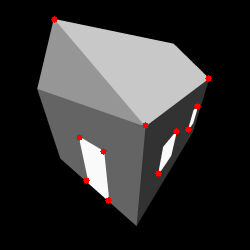  
*Custom Harris corners on `left.jpg`.*

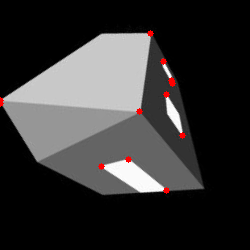  
*Custom Harris corners on 45° rotated image.*

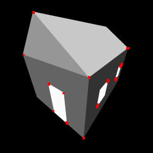  
*OpenCV Harris corners on `left.jpg`.*

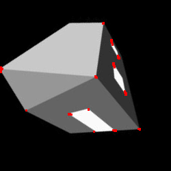  
*OpenCV Harris corners on 45° rotated image.*

### Rotation Effect
Custom implementation stayed **stable** (13 → 13).  
OpenCV detected **slightly more** corners after rotation (272 → 305).

### Scaling Effect
Downscaling to 0.5× reduced detail and corners; upscaling to 2× increased detected corners for OpenCV (272 → 367).  
Both methods are sensitive to **scale and detail density** (more pixels → more detectable corners).

### Parameter Tuning (Harris)
- **Harris constant \(k\)**: lower (e.g., \(k=0.04\)) → more sensitive (detects weaker corners).  
- **Threshold**: lower threshold → more detections but more noise; OpenCV returns full response, you threshold later.  
- **Sobel kernel**: smaller (3) captures finer details but may be noisier.  
- **Gaussian kernel**: (e.g., \(5\times5\)) reduces noise while keeping salient corners.

---

## 2) Task 2 — SIFT Detection and Matching

**SIFT** provides **scale- and rotation-invariant** keypoints and robust descriptors.

**Matches:**

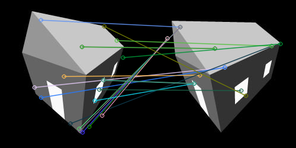  
*SIFT matches between `left.jpg` and `right.jpg`.*

  
*SIFT matches between `notre dame1.jpg` and `notre dame2.jpg`.*

### Harris→Keypoints + ORB Descriptors
Converted Harris corners to keypoints and used **ORB** descriptors for matching as a baseline:

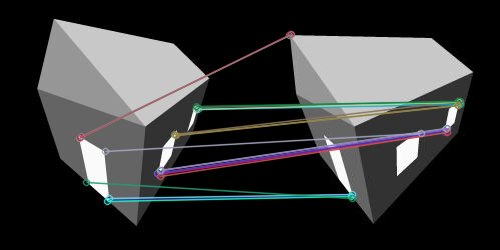  
*Harris corners as keypoints + ORB descriptors on left/right.*

  
*Harris corners as keypoints + ORB descriptors on Notre Dame pair.*

### Observations
- **SIFT** found **more** and **better-distributed** keypoints; matching was robust to rotation/scale (some redundancy/clusters expected).  
- **Harris(+ORB)** produced **fewer** keypoints and struggled more on complex scenes.

---

## 3) Task 3 — Feature Matching in a Robotic Scenario

Applied feature matching to two **stereo datasets**:
- **Custom dataset** from a Boston Dynamics Spot robot  
- **PennCOSYVIO** dataset

Used **ORB** detector and **Brute-Force** matcher.

### Performance Metrics
- **Custom dataset**
  - FPS: **112.13**
  - Avg matches per pair: **11.03**
  - Failed matches: **0**
- **PennCOSYVIO**
  - FPS: **53.31**
  - Avg matches per pair: **231.04**
  - Failed matches: **0**

**Examples (PennCOSYVIO):**

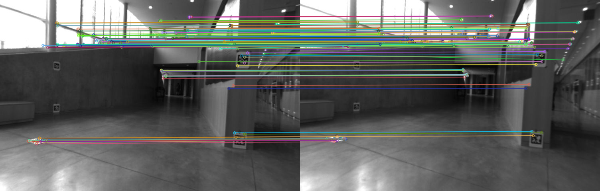  
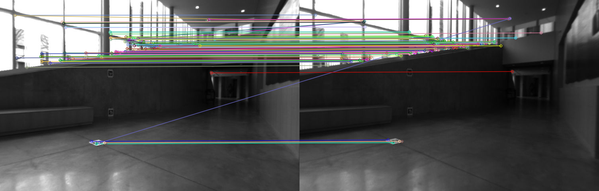  
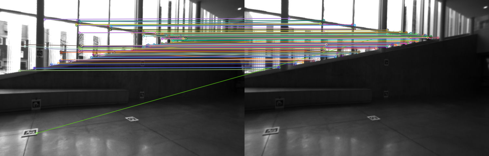

**Examples (Custom):**

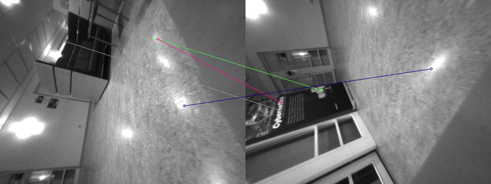  
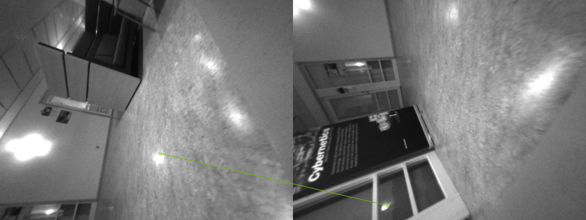  
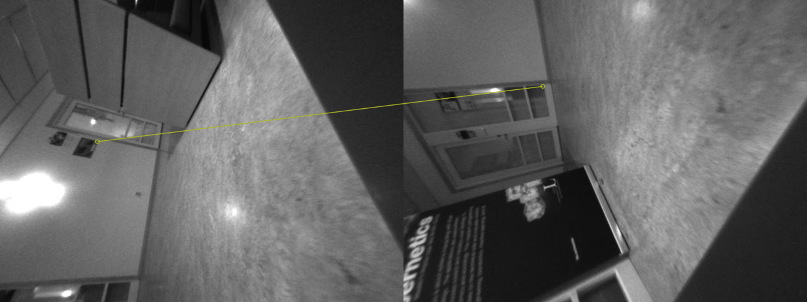

### Observations
- **Custom dataset**: fewer matches — simpler texture, potential noise/low light, and **poorer stereo overlap**.  
- **PennCOSYVIO**: richer texture and better overlap → many more matches.

---

## 🧭 Discussion & Takeaways

- **Custom vs OpenCV Harris**  
  Custom implementation is **selective and stable** across rotation; OpenCV is **more sensitive**, detecting many more corners (useful for dense matching but needs stronger NMS/thresholding).

- **Scale & detail density**  
  Upscaling increases detectable structure → more corners; downscaling removes fine detail → fewer corners. Use **pyramids** or detectors like **SIFT** for scale robustness.

- **SIFT vs Harris(+ORB)**  
  SIFT provides **strong invariance** and **dense, well-distributed** keypoints → better matching under viewpoint/scale changes. Harris+ORB is lighter but less robust on complex scenes.

- **Robotics datasets**  
  Matching quality depends heavily on **texture richness** and **stereo overlap**. High-FPS with few matches can still be insufficient for geometry; prefer **quality over quantity** + geometric verification (e.g., **RANSAC**).

---

## 📌 Notes on Reproduction

- Place all figures referenced above in:  
  `CaseStudy2_FeatureDetection/images/`  
  and keep links as `./images/<filename>`.
- For code, save outputs directly into each task’s `images/` folder (as done in Lab 1).
