# Case Study 4 — Image Segmentation and Feature Tracking

 Magnus H
**Topics:** Otsu thresholding, K-means clustering, SLIC superpixels, Hough line detection, and color-based object counting  
**Tools:** Python (OpenCV, scikit-image, NumPy, Matplotlib)

---

## Task 1: Otsu Thresholding Comparison with Smoothing

A custom Otsu thresholding function was implemented to calculate the optimal threshold and goodness measure based on the image histogram and compared to MATLAB’s built-in `graythresh` function. A Gaussian filter was also applied for smoothing.

### Threshold Comparison
Thresholds computed by custom Otsu and MATLAB’s `graythresh`:

```
Results for: cameraman.tif
Custom Otsu Threshold: 90
Goodness Measure: 11528067657129.21
Built-in graythresh Threshold: 90

Results for: left.jpg
Custom Otsu Threshold: 80
Goodness Measure: 18697756743423.38
Built-in graythresh Threshold: 80
```

### Binary Image Comparison

| Cameraman | Left Image |
|------------|-------------|
|  |  |
| *Custom Otsu Threshold (Cameraman)* | *Built-in `graythresh` Threshold (Cameraman)* |
|  | 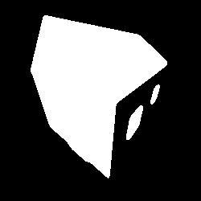 |
| *Custom Otsu Threshold (Left)* | *Built-in `graythresh` Threshold (Left)* |

**Conclusion:**  
Both methods produced identical thresholds and binary images for `cameraman.tif` and `left.jpg`.  
Smoothing improved separation by reducing noise and clarifying foreground vs background.

---

## Task 2: Region-Based Image Segmentation

### K-means Clustering on Original Image
K-means clustering was applied to `lake_gray.png`.  
The elbow plot (WCSS vs. number of clusters) is shown below:

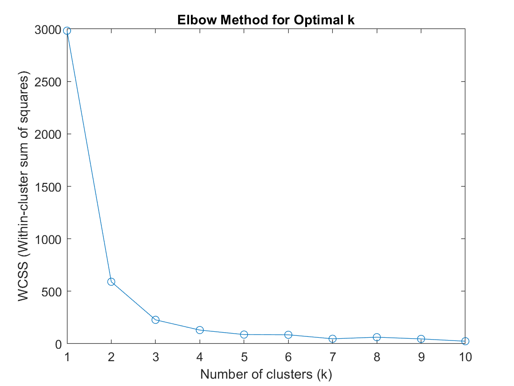  
*Elbow method for determining optimal number of clusters.*

A good `k` lies between **2–4**. The final segmentation used **k = 3**.

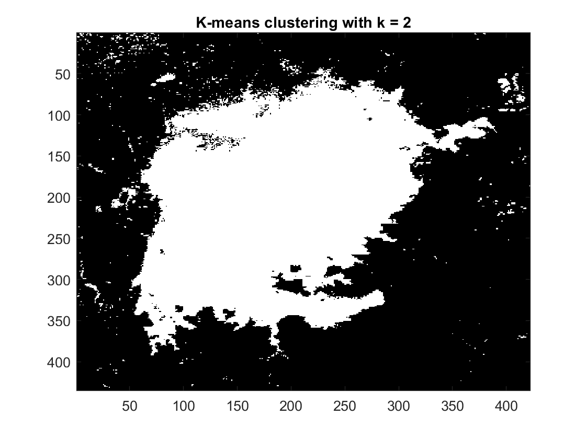  
*K-means clustering with k = 2 on `lake_gray.png`.*

### SLIC Superpixels + K-means

Applied SLIC superpixel segmentation (100, 200, 300 regions).

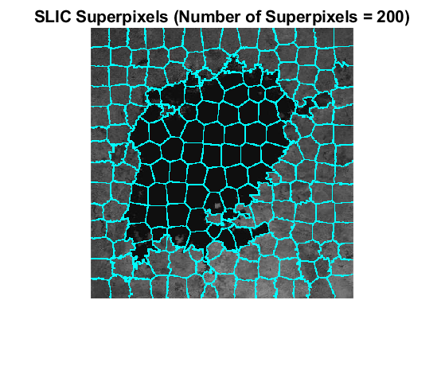  
*SLIC superpixels with 200 regions.*

Then ran K-means on the superpixel output:

| Config | Visualization |
|--------|----------------|
| 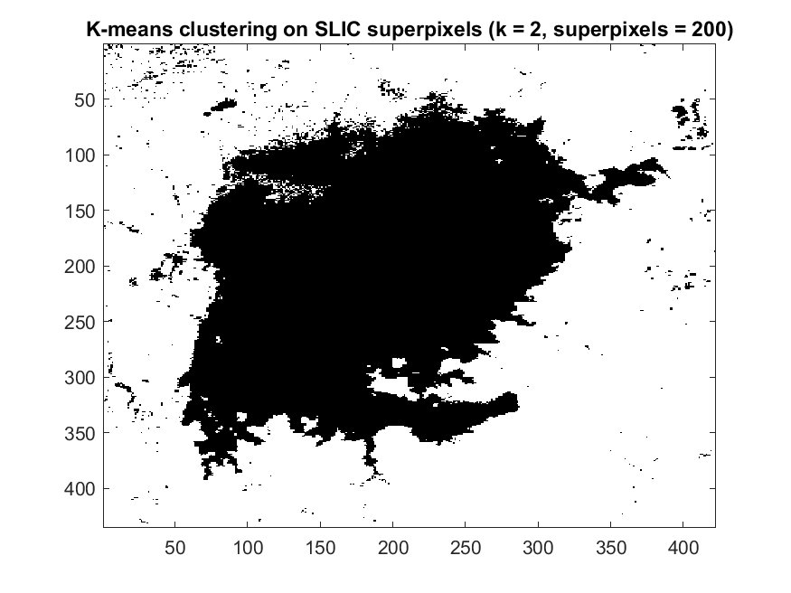 | *k = 2 on 200 SLIC superpixels* |
| 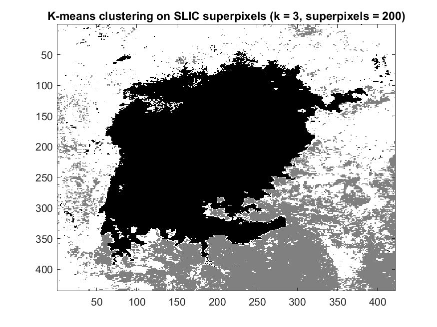 | *k = 3 on 200 SLIC superpixels* |
| 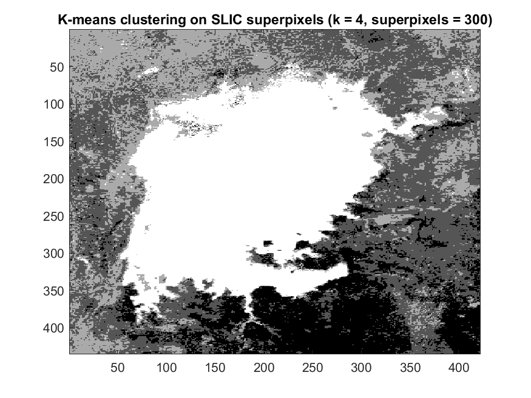 | *k = 4 on 300 SLIC superpixels* |

**Findings:**  
- Elbow method → `k = 2–4`.  
- Visual inspection → `k = 2` best isolates the lake area.  
- Superpixels add boundary preservation and reduce complexity.

---

## Task 3: Line Detection Using Hough Transform

### Canny Edge Detection
Edges extracted from `left.jpg` before Hough transform:

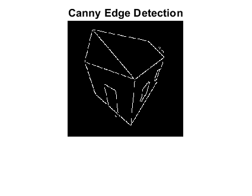  
*Canny edge detection result.*

### Hough Transform and Line Detection
Lines detected from edge image using Hough transform:

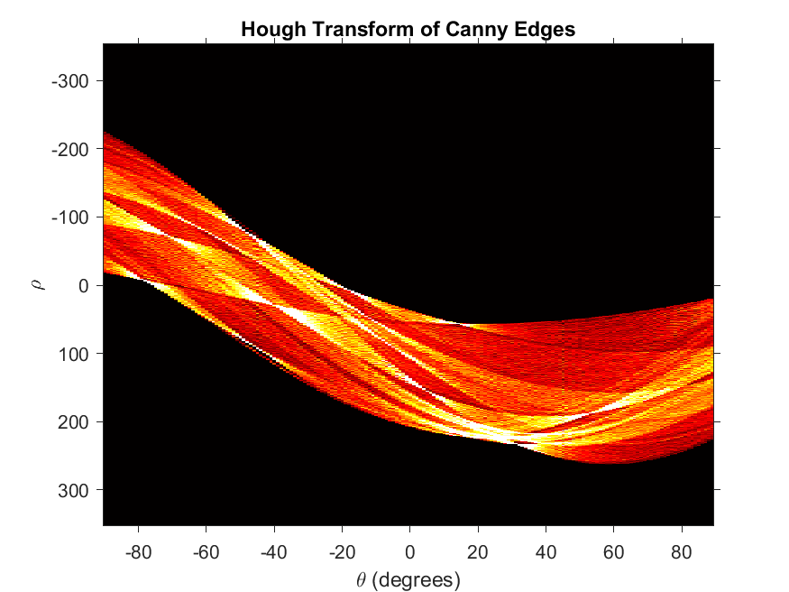  
*Hough transform of Canny edges.*

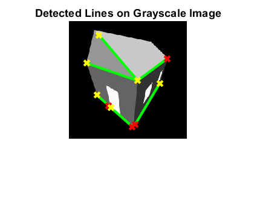  
*Detected lines overlaid on grayscale image.*

---

## Task 4: Counting Red Christmas Balls

### Original Image
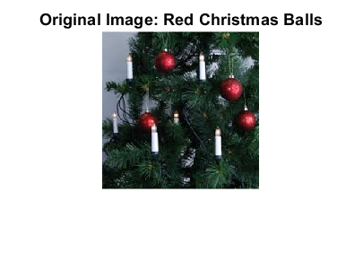  
*Original image: red Christmas balls.*

### Detection Pipeline
Steps:
1. Convert RGB → HSV color space.  
2. Threshold Hue channel to isolate red regions.  
3. Apply morphological cleanup:
   - Fill holes.  
   - Remove small noise.  
4. Use connected-component labeling to count red objects.

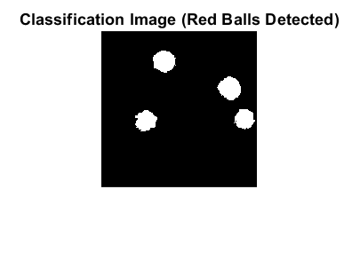  
*Binary classification image — detected 4 balls.*

**Observations:**  
Color segmentation in HSV accurately isolates red objects.  
Morphological cleanup + connected-component labeling correctly counted all distinct balls.

---

### Overall Takeaways
- **Otsu thresholding**: Identical to MATLAB’s built-in, validates correctness of implementation.  
- **K-means + SLIC**: Shows how combining clustering with spatial priors improves segmentation.  
- **Hough Transform**: Demonstrates geometric feature extraction for line structures.  
- **Color segmentation**: Practical HSV-based pipeline for object counting tasks.


